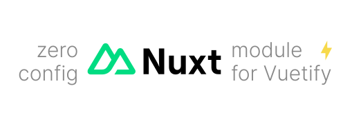

<p align='center'>
<br>
Zero-config Nuxt module for Vuetify
</p>

<p align='center'>
<a href='https://www.npmjs.com/package/vuetify-nuxt-module' target="__blank">

</a>
<a href="https://www.npmjs.com/package/vuetify-nuxt-module" target="__blank">
    
</a>
<!--
<a href="https://vite-pwa-org.netlify.app/frameworks/nuxt" target="__blank">
    
</a>
-->
<br>
<a href="https://github.com/userquin/vuetify-nuxt-module" target="__blank">

</a>
</p>

<br>

## 🚀 Features

- 📖 [**Documentation & guides**](README.md#-features) (WIP)
- 👌 **Zero-Config**: sensible built-in default [Vuetify](https://vuetifyjs.com/) configuration for common use cases
- 🔩 **Extensible**: expose the ability to customize the Vuetify configuration via [Nuxt Plugin Hooks](https://nuxt.com/docs/guide/going-further/hooks#usage-with-plugins)
- ⚡ **Fully tree shakable**: by default, only the needed Vuetify components are imported
- 🛠️ **Versatile**: custom Vuetify [directives](https://vuetifyjs.com/en/getting-started/installation/#manual-steps) and [labs components](https://vuetifyjs.com/en/labs/introduction/) registration
- ✨ **Configurable styles**: configure your variables using [Vuetify SASS Variables](https://vuetifyjs.com/en/features/sass-variables/) 
- 💥 **SSR**: automatic SSR detection and configuration
- 🦾 **Type Strong**: written in [TypeScript](https://www.typescriptlang.org/)

## 📦 Install

> Requires Vite 3.2.0+, will not work with Webpack

```bash
npm i vuetify-nuxt-module -D 

# yarn 
yarn add vuetify-nuxt-module -D

# pnpm 
pnpm add vuetify-nuxt-module -D
```

## 🦄 Usage

> `vuetify-nuxt-module` is strongly opinionated and has a built-in default configuration out of the box. You can use it without any configuration, and it will work for most use cases.

Add `vuetify-nuxt-module` module to `nuxt.config.ts` and configure it:

```ts
// nuxt.config.ts
import { defineNuxtConfig } from 'nuxt/config'

export default defineNuxtConfig({
  modules: [
    'vuetify-nuxt-module'
  ],
  vuetify: {
    moduleOptions: {
      /* module specific options */
    },
    vuetifyOptions: {
      /* vuetify options */
    }
  }
})
```

<!--
Read the [📖 documentation](https://vite-pwa-org.netlify.app/frameworks/nuxt) for a complete guide on how to configure and use
this plugin.
-->

## 👀 Full config

**WIP**
<!--
Check out the type declaration [src/types.ts](./src/types.ts) and the following links for more details.

- [Web app manifests](https://developer.mozilla.org/en-US/docs/Web/Manifest)
- [Workbox](https://developers.google.com/web/tools/workbox)
-->

## 📄 License

[MIT](./LICENSE) License &copy; 2023-PRESENT [Joaquín Sánchez](https://github.com/userquin)
